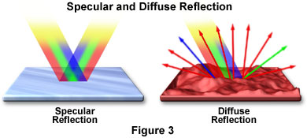
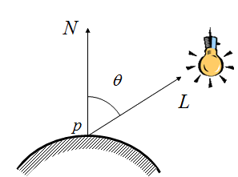
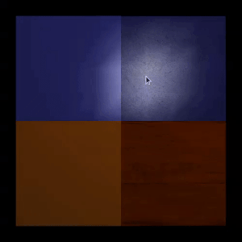
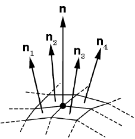
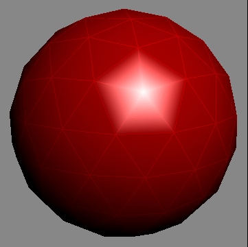
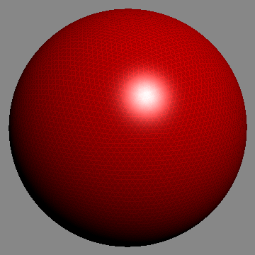

<!-- {"layout": "title"} -->
# Iluminação e Sombreamento
## iluminando e colorindo objetos dinamicamente

---
<!-- {"layout": "centered-horizontal"} -->
# Objetivos

1. Gerar imagens com maior realismo
1. Conhecer formas de modelar a iluminação de objetos
1. Entender os custos computacionais dos diferentes modelos


---
<!-- {"layout": "centered-horizontal"} -->
# Roteiro

1. Iluminação em Computação Gráfica
1. Tipos de modelos
1. Modelo local de Phong
1. Iluminação em OpenGL
1. Sombreamento
1. Atenuação
1. _Fog_ (neblina)

---
<!-- {"layout": "regular", "embedSVG": "img[src$='.svg']", "embeddedStyles": ".geometria-sombreamento .etapa1, .geometria-sombreamento .etapa3, .geometria-sombreamento .etapa4, .geometria-sombreamento .etapa5 {fill: #ddd !important; stroke: #333 !important;} .rasterizacao-sombreamento .etapa1, .rasterizacao-sombreamento .etapa2, .rasterizacao-sombreamento .etapa4 {fill: #ddd !important; stroke: #333 !important;}"} -->
# De volta ao _pipeline_ gráfico

 <!-- {p:.centered} -->

 <!-- {p:.centered} --> <!-- {.geometria-sombreamento} -->

 <!-- {p:.centered} --> <!-- {.rasterizacao-sombreamento} -->

---
<!-- {"layout": "regular"} -->
## Cena sem _vs_ com iluminação

::: figure .picture-steps.clean.opacity-only margin: 0; align-self: center;
 <!-- {.bullet.bullet-no-anim.figure-step.no-margin} -->
 <!-- {.bullet.bullet-no-anim.figure-step.no-margin} --> <!-- {p:.no-margin} -->
:::

---
<!-- {"layout": "regular"} -->
## Iluminação

-  <!-- {.push-right} -->
  Estudo de como a luz interage com objetos de uma cena
    - Como a luz é **emitida**
    - Como ela é **transmitida**
    - Ela é **absorvida, refratada, refletida**?
- Em Computação Gráfica, a iluminação trata do **cálculo da contribuição de cada fonte de luz
  para cada vértice** dos objetos de uma cena e a posterior **determinação da cor (ou sombreamento)
  dos _pixels_**  

---
<!-- {"layout": "regular"} -->
## Fontes de luz

- Alguns objetos podem emanar luz - são chamados **fontes de luz**
- A luz das fontes afeta a superfície dos objetos de uma cena de acordo com as
  características da superfície do objeto - chamamos essas características de
  **material**
- Há vários tipos de fonte de luz:
  1.  <!-- {.push-right style="max-height: 180px"} -->
     Onidirecional (ou pontual)
  1. Direcional
  1. Holofote (_spotlights_)

---
<!-- {"layout": "regular"} -->
## Materiais

- São um modelo de como objetos reagem às fontes de luz
  - Pode ser entendido como o material com que os objetos são feitos:
    - Vidro
    - Madeira
    - Porcelana
- Definem parâmetros de interação com a luz
  - Reflexão
  - Transparência
  - Coeficientes: o quão polido, o quão áspero etc.

---
<!-- {"layout": "section-header"} -->
# Modelos de Iluminação

---
<!-- {"layout": "regular"} -->
# Modelos de Iluminação

- Modelo **físico**
  - _real-life_, programado por Deus em C++
- Modelos **locais**
  - Apenas caminhos do tipo fonte luminosa → superfície → olho são tratados
  - A intensidade da luz em um vértice é dada pelas
    fontes de luz da cena
  - Simples
    - Ex.: Modelo de Phong no OpenGL
- Modelos **globais**
  - Muitos caminhos da transmissão da luz são considerados
  - A intensidade é dada pelas fontes de luz e pela interação dos fótons com
    todos os objetos da cena
  - Complexos (e.g., _ray tracing_, _path tracing_, _radiosidade_)

---
<!-- {"layout": "regular"} -->
## Modelo físico

-  <!-- {.push-right} -->
  A luz é modelada como **radiação eletromagnética**
  - Este modelo está descrito no capítulo de ótica do seu livro de física mais próximo =)
- Leva em conta todas as interações (todos os caminhos da luz), **infinitamente**
- **Intratável** computacionalmente
  - Ou seja, dá pra criar um programa, mas ele não termina em tempo hábil

---
<!-- {"layout": "regular"} -->
## Modelo local

-  <!-- {.push-right} -->
  Considera-se **apenas a porção da luz que vai da fonte de luz para o objeto**
  (vértice) iluminado
  - Um objeto não "tampa" o outro (i.e., sem sombras)
- A luz é discretizada em componentes RGB

Em um modelo local (CG de tempo real), **objetos não projetam sombras**! <!-- {p:.note.info} -->

*[RGB]: Red, Green e Blue*

---
<!-- {"layout": "regular"} -->
## Modelo global

-  <!-- {.push-right} -->
  Considera-se **vários (não todos) caminhos percorridos pela luz**, incluindo a relação
  entre os objetos da cena
  - Um objeto pode impedir que outro receba a luz (i.e., há sombras)
  - Objetos podem ser semi-transparentes e a luz pode refletir ou refratar -
    basta percorrer o caminho inverso da luz


---
<!-- {"layout": "regular"} -->
# Modelo de iluminação (local) de Phong ([1975](http://www.cs.northwestern.edu/~ago820/cs395/Papers/Phong_1975.pdf))

- Uma fonte de luz é descrita por: <!-- {ul^0:.no-margin} -->
  - Uma cor (da luz) em componentes RGB
- Cada objeto da cena é feito por um **material** que:
  - Tem características de objetos foscos (ásperos) (**difusa**)
  - Tem características de objetos polidos e reflete a cor da luz (**especular**)
  - É indiretamente iluminado pelas "infinitas interações" da
    luz na cena (**ambiente**)
    - Pode emitir [0, 100%] luz de uma cor (**emissiva** - "extra Phong")
  - A cor final do vértice pode ser dada pelo **somatório dessas 4 componentes**

 <!-- {style="max-height: 168px"} -->  <!-- {p:.center-aligned.no-margin.full-width} -->
*[RGB]: Red, Green e Blue*

---
<!-- {"layout": "regular"} -->
## Componentes do Modelo de Phong (cont.)


 <!-- {style="max-height: 200px"} --> <!-- {p:.centered } -->

- **Difusa**: contribuição correspondente ao  espalhamento da reflexão
  lambertiana (independe da posição do observador)
- **Especular**: contribuição referente ao comportamento de superfícies polidas
- **Ambiente**: contribuição que não depende da geometria
- **Emissão** (extra Phong): contribuição que não depende de fontes de
  luz (fluorescência)


---
<!-- {"layout": "regular"} -->
## **Cor ambiente** de um objeto

- Ainda que um objeto não esteja diretamente iluminado, ele deve
  aparecer na cena
  - Por causa da iluminação indireta, refletida por todos os objetos da cena
- Não possui características espaciais nem direcionais
- Pode possuir cor
- A quantidade de luz ambiente é constante em todo o ambiente
- A quantidade de luz ambiente refletida por um objeto independe da geometria
  do objeto
  <div class="math centered">C(V) = k_aL_a</div>
  ...onde <span class="math">k_a</span> é o coeficiente ambiente do material<br>
  e <span class="math">L_a</span> é a cor da luz ambiente.

---
<!-- {"layout": "regular"} -->
## **Cor difusa** de um objeto

- Objetos foscos refletem a luz em todas as direções uniformemente e
  possuem uma cor
- Segundo a Lei de Lambert (fluxo de energia):
  - A **luminosidade** aparente da superfície não **depende** da posição do
    observador, mas apenas do cosseno do **ângulo entre a normal e a
    direção da luz**

     <!-- {.push-right} -->
    

---
<!-- {"layout": "regular"} -->
## Calculando a contribuição **difusa**

-  <!-- {.push-right} -->
  A componente difusa (+ambiente) de um vértice <span class="math">V</span> é dada por:

  <div class="math">C(V) = k_aL_a + k_d\sum_iL_i(\vec{s}_i \cdot \vec{n})</div>
  ...onde  <span class="math">k_d</span> é o coeficiente difuso do material,<br>
  o somatório itera somando a contribuição de cada fonte de luz,<br>
  <span class="math">L_i</span> é a cor da fonte de luz atual,<br>
  <span class="math">\vec{s}_i</span> é a incidência da luz (apontando para ela),<br>
  <span class="math">\vec{n}</span> é o vetor normal de <span class="math">V</span>.


---
<!-- {"layout": "regular"} -->
## **Iluminação especular** em um objeto

- Simula a reflexão à maneira de um espelho (objetos altamente polidos)
- Depende da disposição entre observador, objeto e fonte de luz
- Em um espelho perfeito, a reflexão se dá em ângulos iguais
  - Observador só enxergaria a reflexão de uma fonte pontual se estivesse na direção certa

---
<!-- {"layout": "regular"} -->
## Calculando a contribuição **especular**

-  <!-- {.push-right} -->
  A intensidade da contribuição especular em um ponto p é dada por:

  <div class="math">C(V) = k_aL_a + k_d\sum_iL_i(\vec{s}_i \cdot \vec{n}) + k_s\sum_iL_i(\vec{r} \cdot \vec{v})^{k_e}</div>
  ...onde  <span class="math">k_s</span> é o coeficiente especular do material,<br>
  o somatório itera somando a contribuição de cada fonte de luz,<br>
  <span class="math">L_i</span> é a cor da fonte de luz atual,<br>
  <span class="math">\vec{r}_i</span> é a direção da reflexão perfeita da luz,<br>
  <span class="math">\vec{v}</span> é o vetor que aponta de <span class="math">V</span> até a câmera.

---
<!-- {"layout": "regular"} -->
## Expoente de Especularidade

- Indica quão polida é a superfície
  - Espelho ideal tem especularidade infinita
  - Na prática, usam-se valores entre 5 e 100

 <!-- {p:.centered} -->

---
<!-- {"layout": "regular"} -->
## Demonstração do Modelo de Phong

 <!-- {p:.centered} --> <!-- {style="max-height: 300px;"} -->

- Exemplo: [luz-e-material-marte](codeblocks:luz-e-material/CodeBlocks/luz-e-material-marte.cbp)

---
<!-- {"layout": "section-header"} -->
# Iluminação em OpenGL
## com **pipeline fixo** (v1, v2)

1. Algumas funções usadas: <!-- {ol:.content} --> <!-- {li:.no-bullet} -->
   - `glEnable`
   - `glMaterial`
   - `glLight`
   - `glFog`,
   - `glNormal`

---
<!-- {"layout": "regular"} -->
## Iluminação em OpenGL

- Implementa o modelo de iluminação de _Phong_ + componente emissiva
- O modelo é computado **<u>apenas para os vértices</u>** dos polígonos
  - A cor dos pixels no interior dos polígonos é obtida por interpolação linear
- É possível configurar alguns efeitos atmosféricos:

Atenuação da luz
  ~ perde força quanto mais distante

Neblina
  ~ uma névoa a partir de uma distância da câmera

---
<!-- {"layout": "regular"} -->
## Iluminação em OpenGL

- Uma **fonte de luz** é descrita por: <!-- {ul:.multi-column-list-2} -->
  - `glLight` <!-- {code:.push-right.note.info} -->
    Cor ambiente
  - Cor difusa
  - Cor especular
  - Posição
- Um **material** <!-- {.alternate-color} --> é descrito por:
  - `glMaterial` <!-- {code:.push-right.note.info} -->
    Cor ambiente
  - Cor difusa
  - Cor especular e expoente de espec.
  - Cor emissiva

::: figure .layout-split-2.no-margin
 <!-- {style="max-height: 200px"} -->

- Neste exemplo [luz-e-material-ladrilhos](codeblocks:luz-e-material-ladrilhos/CodeBlocks/luz-e-material-ladrilhos.cbp):
  - 01 fonte de luz
  - 02 materiais (versão sem textura, versão com):
    - Plástico azul _(liso, alta especularidade)_
    - Madeira _(áspero)_
:::

---
<!-- {"layout": "regular"} -->
## **3 passos** para iluminar

- O sistema de iluminação do OpenGL vem, por padrão, **desativado**. Para ativá-lo,
  devemos tomar as seguintes medidas:
  1. Ativar/desativar o sistema quando apropriado:
     ```c
     glEnable(GL_LIGHTING);
     //...
     glDisable(GL_LIGHTING);
     ```
  1. Ativar e configurar uma ou mais fontes de luz (veremos como)
  1. Configurar materiais antes de desenhar os objetos  (idem)


---
<!-- {"layout": "regular"} -->
## Passo 2: Ativando **fontes de luz**

- Para ativar uma fonte:
  ```c
  glEnable(source);
  ```
  - `source` é uma constante cujo nome é `GL_LIGHT`**`N`**,
    começando com `GL_LIGHT0`
  - Quantas? Pelo menos 8, mas para ter certeza:
    ```
    glGetIntegerv(GL_MAX_LIGHTS, &n);
    ```

---
<!-- {"layout": "regular"} -->
## Passo 2: Configurando **fontes de luz**

- Para configurar as propriedades de cada fonte:
  ```c
  glLightfv(source, property, value);
  ```
  - `property` é uma constante designando:
    - Coeficientes de cor usados no modelo de iluminação:
      `GL_AMBIENT,` **`GL_DIFFUSE,`** `GL_SPECULAR`
    - Geometria da fonte
     **`GL_POSITION,`** `GL_SPOT_DIRECTION, GL_SPOT_CUTOFF,  GL_SPOT_EXPONENT`
    - Coeficientes de atenuação
      `GL_CONSTANT_ATTENUATION, GL_LINEAR_ATTENUATION, GL_QUADRATIC_ATTENUATION`

---
<!-- {"layout": "regular"} -->
## Passo 3: Configurando o **material**

- Especificados por:
  ```c
  glMaterialfv (face, property, value);
  ```
  - `face` designa quais lados da superfície se quer configurar:
    ```c
    GL_FRONT, GL_BACK, GL_FRONT_AND_BACK;
    ```
  - `property` designa a propriedade do modelo de iluminação:
    ```c
    GL_AMBIENT, GL_DIFFUSE, GL_SPECULAR,
    GL_EMISSION, GL_SHININESS;
    ```

---
<!-- {"layout": "regular"} -->
## Geometria

- Além das propriedades da luz e do material, a **geometria do objeto** também
  é importante
  - A posição dos vértices com relação ao olho e à fonte luminosa
    contribui no cálculo dos efeitos atmosféricos
    - _e.g._, atenuação da energia da luz
  - A _normal_ dos polígonos é fundamental
    - Não é calculada automaticamente
    - Precisa ser especificada com `glNormal()`
    - Mas como calculamos o vetor normal de cada face?

---
<!-- {"layout": "regular"} -->
## Computando o vetor normal

- 
  Triângulo
  - Dados três vértices, podemos:
    <div class="math">\vec{n} = normalizar((A-B)\times(C-A))</div>
- Polígono planar
  - Uma opção é usar a fórmula do triângulo para quaisquer 3 vértices
  - Outra opção é determinar a equação do plano:
    - <span class="math">ax + by + cz + d = 0</span>
    - Normal tem coordenadas <span class="math">(a, b, c)</span>

---
<!-- {"layout": "regular"} -->
## Vetor normal de superfícies paramétricas

- 
  Normal é dada pelo produto vetorial dos gradientes em relação aos
  parâmetros <span class="math">u</span> e <span class="math">v</span>

  

---
<!-- {"layout": "regular"} -->
## Iluminação **ambiente**

- Dada pelas cores `GL_AMBIENT` tanto das fontes luminosas quanto
  dos materiais
- Além das fontes luminosas, o OpenGL possui uma **luz ambiente
  <u>global</u>**, que é usada para iluminar uniformemente todos os
  objetos da cena
  ```c
  glLightMaterialfv (GL_LIGHT_MODEL_AMBIENT, color);
  ```
- Contribuição da luz ambiente global para um vértice é dada por:
  <span class="math">A = I_ak_a</span>, onde:
  - <span class="math">I_a</span> é a cor da luz ambiente global
  - <span class="math">k_a</span> é a cor ambiente do material

---
<!-- {"layout": "regular"} -->
## Fontes <u>posicionais</u> _vs_ <u>direcionais</u>

- É possível **configurar uma fonte de luz** para que ela seja <u>direcional</u>
  em vez de <u>posicional</u>
  - Ao definir a posição da fonte via:
    ```c
    glLightfv(GL_LIGHT0, GL_POSITION, position);
    ```
    se `position` for um vetor cujo 4º elemento é igual a:
      - 1, então a luz é posicional
      - 0, então a luz é direcional
- Para fontes de luz posicionais, é possível definir um fator de
  atenuação que leva em conta a distância <span class="math">d</span> entre
  a fonte de luz e o objeto sendo iluminado

---
<!-- {"layout": "regular"} -->
## **Atenuação**

- A atenuação de uma fonte de luz é calculada como:
  <div class="math">aten = \frac{1}{k_c+k_ld+k_qd^2}</div>
- Os coeficientes são definidos pela função `glLight()`, usando os parâmetros
  `GL_CONSTANT_ATTENUATION, GL_LINEAR_ATTENUATION` e `GL_QUADRATIC_ATTENUATION`
  - Exemplo:
    ```
    glLightf(GL_LIGHT0, GL_LINEAR_ATTENUATION, 1.0);
    ```
- Por padrão, há uma atenuação de:
  - <span class="math">k_c = 1</span>, <span class="math">k_l = 0</span>,
    <span class="math">k_q = 0</span>  

---
<!-- {"layout": "regular"} -->
## Cor resultante de um vértice: <span class="math">C</span>

- A atenuação só é aplicada sobre as componentes difusa
  <span class="math">D</span> e especular <span class="math">S</span>
  - Não faz sentido para ambiente <span class="math">A</span>, nem
    emissiva <span class="math">E</span>
- A fórmula que calcula a cor de um vértice devida a uma **fonte luminosa
  <span class="math">i</span>** é dada por:
  <div class="math">C_i=A_i + aten(D_i + S_i)</div>
- Portanto, no total, a cor é dada pela contribuição da iluminação ambiente (parcela não associada com fontes de luz)
  somada à luz emitida e às contribuições fonte luminosa
    <span class="math">C_i</span>:

    <div class="math">C=A_{global} + E + \sum{(A_i + aten(D_i + S_i))}</div>

---
<!-- {"layout": "regular"} -->
# Recapitulando iluminação

- Vimos alguns modelos para simularmos um sistema de iluminação local
  nas nossas cenas de forma a torná-las mais realísticas
- O modelo de iluminação **calcula a cor <u>de cada vértice</u>** da
  nossa geometria, dadas fontes de luz e o material dos objetos
- Contudo, ainda não sabemos a **cor <u>de cada pixel</u>**, que é o
  que precisamos para gerar imagens

---
<!-- {"layout": "regular", "embedSVG": "img[src$='.svg']", "embeddedStyles": ".geometria-sombreamento .etapa1, .geometria-sombreamento .etapa3, .geometria-sombreamento .etapa4, .geometria-sombreamento .etapa5 {fill: #ddd !important; stroke: #333 !important;} .rasterizacao-sombreamento .etapa1, .rasterizacao-sombreamento .etapa2, .rasterizacao-sombreamento .etapa4 {fill: #ddd !important; stroke: #333 !important;}"} -->
# De volta ao _pipeline_ gráfico

 <!-- {p:.centered} -->

 <!-- {p:.centered} --> <!-- {.geometria-sombreamento} -->

 <!-- {p:.centered} --> <!-- {.rasterizacao-sombreamento} -->

---
<!-- {"layout": "regular", "embedSVG": "img[src$='.svg']"} -->
## Fase do **Rasterizador**

 <!-- {p:.centered} --> <!-- {.rasterizacao-sombreamento} -->

- <u>Sombreamento de Pixels</u>
  - Para cada fragmento (pixel) de cada objeto (triângulo), devemos obter sua cor
- Já temos a cor de **cada vértice**, mas precisamos determinar a cor de cada
  fragmento agora
  - Para isso, precisamos de uma equação que, dadas as cores dos vértices
    de um objeto, possamos **determinar a cor para cada fragmento**

---
<!-- {"layout": "section-header", "slideClass": "shading"} -->
# Sombreamento

- Formas de colorir a parte interna dos objetos:
  1. Mesma cor para todos os fragmentos (**_flat_**)
  1. Interpolar as cores dos vértices (**Gouraud**)
  1. Calcular a equação de iluminação inteira para cada fragmento  (**Phong**)

---
<!-- {"layout": "regular"} -->
## Tipos de Sombreamento

- Há três tipos principais de sombreadores:
  - 1. Constante (_flat_)
    ```c
    glShadeModel(GL_FLAT);
    ```
  - 2. Gouraud
    ```c
    glShadeModel(GL_SMOOTH);    // é o valor padrão
    ```
  - 3. Phong
    ```c
    glShadeModel(GL_PHONG);    // não existe no pipeline fixo
    ```

---
<!-- {"layout": "regular"} -->
# _Flat shading_ (sombreamento constante)

 <!-- {p:.centered} -->

- **Todos os fragmentos** da primitiva têm **a mesma cor**
  - Mas e se for um triângulo (3x vértice)? É a cor do _provoking_ vértice (tipicamente o primeiro declarado)
- Requer a especificação de **01 vetor normal para cada polígono**
- Extremamente rápido, mas produz imagens facetadas, pois a transição de um
  polígono para outro adjacente é nítida

---
<!-- {"backdrop": "lowpoly"} -->
# _Low poly is the new pixel art_

---
## Desenhos com _flat shading_

<figure class="picture-steps">
  
  
  
  
</figure>

---
<!-- {"layout": "regular"} -->
# 2. _Gouraud shading_

 <!-- {p:.centered} -->

-  <!-- {.push-right} -->
  Usa a cor calculada **em cada vértice** pelo modelo de iluminação
- Para colorir o polígono, **interpola a cor dos vértices** em seu interior
- Qualidade da imagem é muito maior, mas o custo é maior
- Deve haver **01 vetor normal por vértice** (e não por face)
  - Ele precisa ser fornecido como a média das normais das faces
  adjacentes ao vértice de volta


---
## Limitações do _Gouraud shading_

- Realces da luz especular (**_highlights_**) sofrem por baixa amostragem de
  vértices

  
  

---
# 3. _Phong shading_


- Não confundir com o **modelo de iluminação de _Phong_**

---
# _Phong shading_ (cont.)

- <u>Interpola as normais</u> dos vértices para os pixels, em vez das cores
  - A função de iluminação deve ser avaliada **para cada pixel**
- Significativamente mais caro
- Não oferecido pelo OpenGL no _pipeline_ gráfico fixo
  - É possível implementar usando versões mais novas do OpenGL

---
## Consertando o problema dos _highlights_ de Gouraud


Em **_Gouraud_**, temos uma amostragem de vértices muito menor &rarr;


&larr; Em **_Phong_**, a amostragem é bem maior


---
## Comparação dos três modelos de **sombreamento**


---
# _Fog_

---
## Neblina (_Fog_)

<figure class="picture-steps">
  
  
  
</figure>

---
## Zelda 64 e Turok 64


<div style="display: block"><iframe src="https://www.youtube.com/embed/_9AcRhzV3qA?ecver=2&start=3" width="380" height="285" style="float: left;" frameborder="0" allowfullscreen></iframe><iframe src="https://www.youtube.com/embed/cOVpcC8GwXM?ecver=2&start=42" width="380" height="285" style="float: right;" frameborder="0" allowfullscreen></iframe></div>


---
## _Fog_ com cor do _skybox_ no Temple Run 2

<iframe src="https://www.youtube.com/embed/wTTrtp-yy4I?ecver=2&start=55" width="600" height="450" frameborder="0" allowfullscreen></iframe>

---
## _Fog_ (cont.)

```c
  float[] cor = { .5f, .5f, .5f };
  glClearColor(cor[0], cor[1], cor[2], 1.0f);

  glFogi(GL_FOG_MODE, GL_EXP);        // Linear, exp. ou exp²
  glFogfv(GL_FOG_COLOR, cor);         // Cor
  glFogf(GL_FOG_DENSITY, 0.35f);      // Densidade
  glHint(GL_FOG_HINT, GL_DONT_CARE);  // Não aplicar se não puder
  glFogf(GL_FOG_START, 1.0f);         // Profundidade inicial
  glFogf(GL_FOG_END, 5.0f);           // Profundidade final
  glEnable(GL_FOG);                   // Liga GL_FOG
```
- [Referência do `glFog`](https://www.opengl.org/sdk/docs/man2/xhtml/glFog.xml)
- Cor da neblina = cor do `glClearColor`

---
# Referências

- Livro _Real-Time Rendering (3<sup>rd</sup> edition)_
  - Capítulo 5: _Visual Appearance_
- Livro _Computer Graphics with OpenGL (4<sup>th</sup> edition)_
  - Capítulo 17: _Illumination Models and Surface-Rendering Methods_
- Livro _Computer Graphics through OpenGL (2<sup>nd</sup> edition)_
  - Capítulo 11: [_Color and Light_](http://www.sumantaguha.com/files/materials/ch11.pdf)
- _Red Book_
  - [Capítulo 5: _Lighting_](http://www.glprogramming.com/red/chapter05.html)
  - [Capítulo 6: _Blending, Antialiasing, Fog, and Polygon Offset_](http://www.glprogramming.com/red/chapter06.html)
