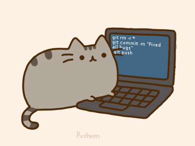
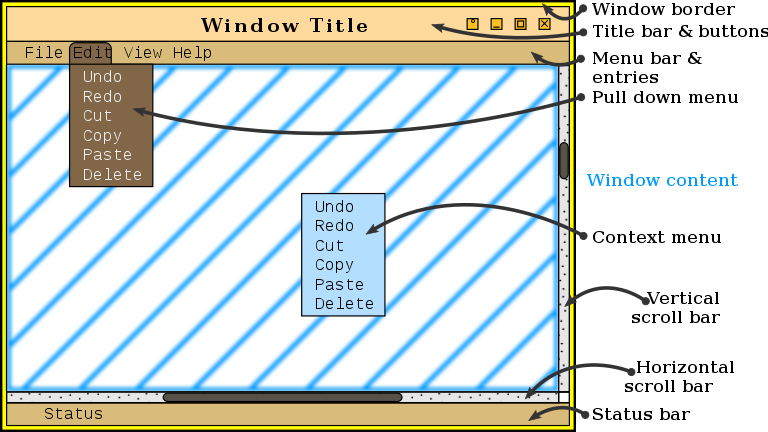

<!-- {"layout": "title"} -->
# Introdução ao OpenGL
## Sistemas de Janelas e GLUT

---
<!-- {"layout": "centered" -->
# Roteiro

1. _Hello World_ em OpenGL
1. Sistemas de janelas
1. Criando um projeto OpenGL
1. ~~GLUT~~ Freeglut
1. TP0

---
<!-- {"layout": "section-header", "slideClass": "hello-world"} -->
# _Hello World_

1. Qual o menor programa em OpenGL?
1. O que é OpenGL?
1. OpenGL é igual desde que surgiu?

---
```c
#include <GL/glew.h>
#include <GL/freeglut.h>

void desenhaMinhaCena() {
    glClearColor(1.0, 1.0, 1.0, 1.0);
    glClear(GL_COLOR_BUFFER_BIT);
    glColor3f(0.0, 1.0, 0.0);
    glBegin(GL_TRIANGLE_FAN);
        glVertex3f(-0.5, -0.5, 0.0);
        glVertex3f( 0.5, -0.5, 0.0);
        glVertex3f( 0.5,  0.5, 0.0);
        glVertex3f(-0.5,  0.5, 0.0);
    glEnd();
    glFlush();
}

int main(int argc, char** argv) {
    glutInit(&argc, argv);
    glutInitContextVersion(1, 1);
    glutInitContextProfile(GLUT_COMPATIBILITY_PROFILE);
    glutInitDisplayMode(GLUT_SINGLE);
    glutInitWindowSize(500, 500);
    glutInitWindowPosition(100, 100);
    glutCreateWindow("Hello World");

    glutDisplayFunc(desenharMinhaCena);

    glutMainLoop();
    return 0;
}
```

---
<!-- {"layout": "centered", "state": "show-active-slide-and-previous"} -->
Executando nosso [_Hello World_](codeblocks:hello-world/CodeBlocks/hello-world.cbp)...


 <!-- {style="border: 1px solid gray; border-radius: 3px;"} -->

Apenas uma janelinha branca com um quadrado verde :)


---
<!-- {"layout": "regular"} -->
# OpenGL

- _Open Graphics Library_ ou biblioteca gráfica aberta
- Basicamente, nos possibilita desenhar na tela
- Funciona como uma **máquina de estados**, _e.g._:
  - Existe o conceito de "cor selecionada" e tudo é desenhado com essa cor,
    até que se selecione outra
- É uma **API** (_Application Programming Interface_) de acesso a **recursos
  (algoritmos e mesmo _hardware_) gráficos**, que oferece rotinas para: <!-- {li:.bullet-old} -->
  - **Desenhar primitivas geométricas (polígonos)** e imagens
  - **Alterar variáveis de estado** (cor, material, fontes de luz)
  - Consultar variáveis de estado

---
<!-- {"layout": "centered-horizontal"} -->
## Máquina de Estados <sub>WTH?</sub>

::: gallery .layout-split-2 display: flex; flex-direction: row;


:::

---
<!-- {"layout": "regular"} -->
# OpenGL

- _Open Graphics Library_ ou biblioteca gráfica aberta <!-- {li^0:.bullet-old} -->
- Basicamente, nos possibilita desenhar na tela <!-- {li^0:.bullet-old} -->
- Funciona como uma **máquina de estados**, _e.g._: <!-- {li^0:.bullet-old} -->
  - Existe o conceito de "cor selecionada" e tudo é desenhado com essa cor, <!-- {li^0:.bullet-old} -->
    até que se selecione outra
- É uma **API** (_Application Programming Interface_) de acesso a **recursos
  (algoritmos e mesmo _hardware_) gráficos**, que oferece rotinas para:
  - **Desenhar primitivas geométricas (polígonos)** e imagens
  - **Alterar variáveis de estado** (cor, material, fontes de luz)
  - Consultar variáveis de estado

---
<!-- {"layout": "centered-horizontal"} -->
## Definição de **interface**

> s.f., elemento que proporciona uma **ligação** física ou lógica<br>
> **entre dois sistemas ou partes** de um sistema que não poderiam ser<br>
> conectados diretamente.

<!-- {blockquote:.centered.bullet} -->

::: figure .bulleted max-height: 220px
- ## carro - motorista <!-- {ul:.card-list} -->
   <!-- {style="max-height: 180px"} -->
- ## usuário - computador
   <!-- {style="max-height: 180px"} -->
- ## programa - programa
   <!-- {style="max-height: 180px"} -->

---
<!-- {"layout": "regular", "styles": "../../styles/classes/opengl-timeline.css"} -->
# OpenGL e suas versões

[↪️ Versão expandida](timeline.html) <!-- {.badge.push-right target="_blank"} --> OpenGL é um padrão em evolução, gerido pelo [Khronos Group][khronos]. <!-- {p:style="width: 100%"} -->

::: vis timeline ./opengl-versions.json .timeline

:::

[khronos]: https://www.khronos.org/

---
<!-- {"layout": "regular"} -->
## OpenGL e o contexto da janela

-  <!-- {.push-right.small-width} -->
  **OpenGL cuida apenas de gerar o "conteúdo" das janelas**, ele precisa
  de uma janela
- _Sistema de janelas_: componente do sistema operacional (SO) que
  lida com janelas:
  1. criar uma janela
  1. maximizar, minimizar
  1. fechamento da janela etc.
- Exemplos:

Linux
  ~ X.11

OSX
  ~ Quartz Compositor

Windows
  ~ Desktop Window Manager (DWM)

<!-- {dl:.no-margin} -->

*[DWM]: desktop window management*

---
<!-- {"layout": "section-header", "slideClass": "window-system"} -->
# Sistemas de janelas

1. Por quê precisamos de um
1. O que muda na programação
1. Formas para desenhar na tela
1. Como suportar vários SOs?

*[SO]: sistema operacional*

---
<!-- {"layout": "regular"} -->
## Sistemas de janelas (**SJ**)

- Principal meio de interação homem/máquina
  - Baseado no conceito de
    <abbr title="Windows, Icons, Menus and Pointers">WIMP</abbr>
- **Tela é dividida em janelas** (eventualmente sobrepostas) **controladas por
  aplicações** que têm a incumbência de mantê-las sempre atualizadas
- **Cada sistema operacional tem o seu SJ** e o linux tem várias opções
  - X.11: `#include 'x.h'`
  - Quartz: `#include 'QuartzCore/QuartzCore.h'`
  - DWM: `#include 'windows.h'`
- Cada sistema de janelas possui uma <u>API distinta</u>
  - Ou seja, uma aplicação feita com `windows.h` não funciona no Linux

*[SJ]: sistema de janelas*
*[DWM]: desktop window management*

---
<!-- {"layout": "regular"} -->
## Como programar uma aplicação gráfica?

<!-- Utiliza o paradigma de **programação orientada a eventos** (PoE) -->

- Programação **tradicional** <!-- {ul^0:.layout-split-2.flex-equal.fold-2.no-bullet.compact-code} --> <!-- {strong:.alternate-color} --> <!-- {li:.bullet} -->
  ```py
  programa()
    le_entrada()
    processa()
    produz_saida()
  ```
  - Usuário não pode interagir durante o processamento
  -  <!-- {.push-left.half-width} -->
    Inadequado para aplicações **interativas**
- Programação orientada por **eventos** <!-- {li:.bullet} -->
  ```py
  teclaPress(qualTecla)
    if (qualTecla == 'k') //...

  programa()
    registra_evento("teclado", teclaPress)
    while (not termina_aplicacao)
      verifica_eventos()
  ```
  - A interação é comunicada via **eventos**, _eg_:  <!-- {li^1:style="margin-left: 1em"} -->
    - 💻 a tecla <kbd>k</kbd> foi pressionada
  - Eventos são "tratados" por **rotinas _callback_**
    - 🔃 redesenhar quando for redimensionada
    - ⬆️ mover algo quando <kbd>W</kbd> for pressionada

---
<!-- {"layout": "regular", "state": "show-active-slide-and-previous"} -->
### Fluxo de execução <!-- {style="width: 50%; align-self: flex-end; margin-right: 5em; text-align: right"} -->

1. O programa registra _callbacks_ para eventos <!-- {ol:style="width: 40%; align-self: flex-end; margin-right: 5em;"} -->
1. O programa fica em _loop_ até ser encerrado
   - Dentro do _loop_:
     1. Verifica se houve interação. Se sim, "dispara" **evento**
     1. Se existir uma **_callback_** registrada, executa

::: did-you-know .note.info width: 45%; align-self: flex-end; margin-right: 5em;
O SJ é responsável por identificar eventos e invocar as _callbacks_. <!-- {p:.smaller-text-80} -->
O programador apenas cria e registra _callbacks_.
:::

*[SJ]: sistema de janelas*

---
<!-- {"layout": "regular"} -->
# APIs de sistemas de janelas

As APIs expõem rotinas para, por exemplo:

::: figure .layout-split-2
1. **Criar uma janela**
1. **Reposicionar e desenhar** janela
1. **Registrar _callbacks_** para eventos
1. Desenhar botões, barras, menus (**_widgets_**) _➡️_ <!-- {.push-right} -->

 <!-- {.large-width} -->
:::

---
<!-- {"layout": "regular", "state": "emphatic", "embeddedStyles": ".quiz { list-style-type: none; } .quiz li::before { content: '( ) '; display: inline; font-family: monospace; } .quiz li.correct::before { content: '(x) '; }"} -->
## Interação do OpenGL com os SJs

Um programa OpenGL...
- é um programa comum <!-- {ul:.quiz.bullet} -->
- precisa de uma janela (fornecida por um SJ)
- deve desenhar no conteúdo ("miolo") da janela
- deve registrar _callbacks_ para eventos de interesse
- todas as anteriores <!-- {li:.correct} -->

Vamos ver um programa OpenGL usando `windows.h` e outro usando `glx.h`. <!-- {p:.bullet} -->

---
<!-- {"layout": "3-column-element-with-titles-expansible", "scripts": "../../scripts/classes/surprise.js"} -->
## `windows.h` [🌐](https://gist.github.com/fegemo/1f534a2a59d7d289ec48)

```c
#include <windows.h>
#include <GL/gl.h>

char *className = "OpenGL";
char *windowName = "Hello World";
int winX = 0, winY = 0;
int winWidth = 500, winHeight = 500;

HDC hDC;
HGLRC hGLRC;
HPALETTE hPalette;

void desenhaMinhaCena()
{
    glClearColor(1, 1, 1, 1);
    glClear(GL_COLOR_BUFFER_BIT);

    // desenha um quadrado
    glColor3f(0, 1, 0);
    glBegin(GL_TRIANGLE_FAN);
        glVertex3f(-0.5, -0.5, 0.0);
        glVertex3f( 0.5, -0.5, 0.0);
        glVertex3f( 0.5,  0.5, 0.0);
        glVertex3f(-0.5,  0.5, 0.0);
    glEnd();
    glFlush();

    SwapBuffers(hDC);
}

void redimensiona()
{
    // define a tela de pintura como a janela toda
    glViewport(0, 0, winWidth, winHeight);
}

void setupPixelFormat(HDC hDC)
{
    PIXELFORMATDESCRIPTOR pfd = {
        sizeof(PIXELFORMATDESCRIPTOR),  // tamanho
        1,                              // versão
        PFD_SUPPORT_OPENGL |
        PFD_DRAW_TO_WINDOW |
        PFD_DOUBLEBUFFER,               // buffer dpulo
        PFD_TYPE_RGBA,                  // formato da cor
        16,                             // profundidade da cor
        0, 0, 0, 0, 0, 0,               // bits de cor (ignorado)
        0,                              // sem alfa buffer
        0,                              // bits de alfa (ignorado)
        0,                              // sem accumulation buffer
        0, 0, 0, 0,                     // bits de acumulação (ignorado)
        16,                             // buffer de profundidade
        0,                              // sem stencyl buffer
        0,                              // sem buffers auxiliares
        PFD_MAIN_PLANE,                 // camada principal
        0,                              // reservado
        0, 0, 0,                        
    };
    int pixelFormat;

    pixelFormat = ChoosePixelFormat(hDC, &pfd);
    if (pixelFormat == 0) {
        MessageBox(WindowFromDC(hDC), "ChoosePixelFormat falhou.", "Erro",
                MB_ICONERROR | MB_OK);
        exit(1);
    }

    if (SetPixelFormat(hDC, pixelFormat, &pfd) != TRUE) {
        MessageBox(WindowFromDC(hDC), "SetPixelFormat falhou.", "Erro",
                MB_ICONERROR | MB_OK);
        exit(1);
    }
}

void setupPalette(HDC hDC)
{
    int pixelFormat = GetPixelFormat(hDC);
    PIXELFORMATDESCRIPTOR pfd;
    LOGPALETTE* pPal;
    int paletteSize;

    DescribePixelFormat(hDC, pixelFormat, sizeof(PIXELFORMATDESCRIPTOR), &pfd);

    if (pfd.dwFlags & PFD_NEED_PALETTE) {
        paletteSize = 1 << pfd.cColorBits;
    } else {
        return;
    }

    pPal = (LOGPALETTE*)
        malloc(sizeof(LOGPALETTE) + paletteSize * sizeof(PALETTEENTRY));
    pPal->palVersion = 0x300;
    pPal->palNumEntries = paletteSize;

    // constrói uma paleta RGB
    {
        int redMask = (1 << pfd.cRedBits) - 1;
        int greenMask = (1 << pfd.cGreenBits) - 1;
        int blueMask = (1 << pfd.cBlueBits) - 1;
        int i;

        for (i=0; i<paletteSize; ++i) {
            pPal->palPalEntry[i].peRed =
                    (((i >> pfd.cRedShift) & redMask) * 255) / redMask;
            pPal->palPalEntry[i].peGreen =
                    (((i >> pfd.cGreenShift) & greenMask) * 255) / greenMask;
            pPal->palPalEntry[i].peBlue =
                    (((i >> pfd.cBlueShift) & blueMask) * 255) / blueMask;
            pPal->palPalEntry[i].peFlags = 0;
        }
    }

    hPalette = CreatePalette(pPal);
    free(pPal);

    if (hPalette) {
        SelectPalette(hDC, hPalette, FALSE);
        RealizePalette(hDC);
    }
}

LRESULT APIENTRY WndProc(
    HWND hWnd,
    UINT message,
    WPARAM wParam,
    LPARAM lParam)
{
    switch (message) {
    case WM_CREATE:
        // inicializa renderização em OpenGL
        hDC = GetDC(hWnd);
        setupPixelFormat(hDC);
        setupPalette(hDC);
        hGLRC = wglCreateContext(hDC);
        wglMakeCurrent(hDC, hGLRC);
        return 0;
    case WM_DESTROY:
        // finaliza renderização em OpenGL
        if (hGLRC) {
            wglMakeCurrent(NULL, NULL);
            wglDeleteContext(hGLRC);
        }
        if (hPalette) {
            DeleteObject(hPalette);
        }
        ReleaseDC(hWnd, hDC);
        PostQuitMessage(0);
        return 0;
    case WM_SIZE:
        // o tamanho da janela foi alterado
        if (hGLRC) {
            winWidth = (int) LOWORD(lParam);
            winHeight = (int) HIWORD(lParam);
            redimensiona();
            return 0;
        }
    case WM_PALETTECHANGED:
        // ativa a paleta de cores escolhida
        if (hGLRC && hPalette && (HWND) wParam != hWnd) {
            UnrealizeObject(hPalette);
            SelectPalette(hDC, hPalette, FALSE);
            RealizePalette(hDC);
            desenhaMinhaCena();
            break;
        }
        break;
    case WM_QUERYNEWPALETTE:
        // reativa a paleta de cores
        if (hGLRC && hPalette) {
            UnrealizeObject(hPalette);
            SelectPalette(hDC, hPalette, FALSE);
            RealizePalette(hDC);
            desenhaMinhaCena();
            return TRUE;
        }
        break;
    case WM_PAINT:
        // desenha a cena
        {
            PAINTSTRUCT ps;
            BeginPaint(hWnd, &ps);
            if (hGLRC) {
                desenhaMinhaCena();
            }
            EndPaint(hWnd, &ps);
            return 0;
        }
        break;
    case WM_CHAR:
        // o teclado foi pressionado (alguma tecla)
        switch ((int)wParam) {
        case VK_ESCAPE:
            DestroyWindow(hWnd);
            return 0;
        default:
            break;
        }
        break;
    default:
        break;
    }
    return DefWindowProc(hWnd, message, wParam, lParam);
}

int APIENTRY
WinMain(
    HINSTANCE hCurrentInst,
    HINSTANCE hPreviousInst,
    LPSTR lpszCmdLine,
    int nCmdShow)
{
    WNDCLASS wndClass;
    HWND hWnd;
    MSG msg;

    // registra a classe da janela
    wndClass.style = CS_OWNDC | CS_HREDRAW | CS_VREDRAW;
    wndClass.lpfnWndProc = WndProc;
    wndClass.cbClsExtra = 0;
    wndClass.cbWndExtra = 0;
    wndClass.hInstance = hCurrentInst;
    wndClass.hIcon = LoadIcon(NULL, IDI_APPLICATION);
    wndClass.hCursor = LoadCursor(NULL, IDC_ARROW);
    wndClass.hbrBackground = GetStockObject(BLACK_BRUSH);
    wndClass.lpszMenuName = NULL;
    wndClass.lpszClassName = className;
    RegisterClass(&wndClass);

    // cria a janela
    hWnd = CreateWindow(
        className, windowName,
        WS_OVERLAPPEDWINDOW | WS_CLIPCHILDREN | WS_CLIPSIBLINGS,
        winX, winY, winWidth, winHeight,
        NULL, NULL, hCurrentInst, NULL);

    // mostra a janela
    ShowWindow(hWnd, nCmdShow);
    UpdateWindow(hWnd);

    // entra em loop para ficar processando os eventos
    while (GetMessage(&msg, NULL, 0, 0) == TRUE) {
        TranslateMessage(&msg);
        DispatchMessage(&msg);
    }
    return msg.wParam;
}

// 245 linhas 😖!!!
```

## `glx.h` [🌐](https://gist.github.com/fegemo/d3380b9f212d35f8a7ab76a54436a522)

```c
#include <stdio.h>
#include <stdlib.h>
#include <X11/X.h>
#include <X11/Xlib.h>
#include <GL/gl.h>
#include <GL/glx.h>

void desenhaMinhaCena()
{
    glClearColor(1, 1, 1, 1);
    glClear(GL_COLOR_BUFFER_BIT);

    // desenha um quadrado
    glColor3f(0, 1, 0);
    glBegin(GL_TRIANGLE_FAN);
        glVertex3f(-0.5, -0.5, 0.0);
        glVertex3f( 0.5, -0.5, 0.0);
        glVertex3f( 0.5,  0.5, 0.0);
        glVertex3f(-0.5,  0.5, 0.0);
    glEnd();
    glFlush();
}

int main(int argc, char *argv[]) {
    Display *display; //*
    Window root;
    GLint configuration[] = { GLX_RGBA, GLX_DEPTH_SIZE, 24, GLX_DOUBLEBUFFER, None };
    XVisualInfo *vi; //*
    Colormap colormap;
    XSetWindowAttributes swa;
    Window win;
    GLXContext context;
    XWindowAttributes gwa;
    XEvent event;

    display = XOpenDisplay(NULL);

    if (display == NULL) {
        printf("Erro ao conectar ao X server\n");
        exit(-1);
    }

    root = DefaultRootWindow(display);
    vi = glXChooseVisual(display, 0, configuration);

    if(vi == NULL) {
        printf("Não foi possível escolher as configurações\n");
        exit(-1);
    }

    colormap = XCreateColormap(display, root, vi->visual, AllocNone);

    swa.colormap = colormap;
    swa.event_mask = ExposureMask | KeyPressMask;

    win = XCreateWindow(
      display,
      root,
      0, 0,
      500, 500,
      0,
      vi->depth,
      InputOutput,
      vi->visual,
      CWColormap | CWEventMask,
      &swa);

    XMapWindow(display, win);
    XStoreName(display, win, "Hello World");

    context = glXCreateContext(display, vi, NULL, GL_TRUE);
    glXMakeCurrent(display, win, context);


    while (1) {
        XNextEvent(display, &event);

        switch (event.type) {
        case Expose:
            XGetWindowAttributes(display, win, &gwa);
            glViewport(0, 0, gwa.width, gwa.height);
            desenhaMinhaCena();
            glXSwapBuffers(display, win);
            break;

        case KeyPress:
            glXMakeCurrent(display, None, NULL);
            glXDestroyContext(display, context);
            XDestroyWindow(display, win);
            XCloseDisplay(display);
            exit(0);
            break;
        }
    }

    return 0;
}
// 97 linhas 😞
```

## **Freeglut** <!-- {.surprise} --> [🌐](https://gist.github.com/fegemo/ddfa33441281e564eefe)

```c
#include <GL/freeglut.h>

void desenhaMinhaCena()
{
    glClearColor(1, 1, 1, 1);
    glClear(GL_COLOR_BUFFER_BIT);
    glBegin(GL_TRIANGLE_FAN);
        glVertex3f(-0.5, -0.5, 0.0);
        glVertex3f( 0.5, -0.5, 0.0);
        glVertex3f( 0.5,  0.5, 0.0);
        glVertex3f(-0.5,  0.5, 0.0);
    glEnd();
    glFlush();
}

int main(int argc, char** argv)
{
    glutInit(&argc, argv);
    glutInitDisplayMode(GLUT_SINGLE);
    glutInitWindowSize(500, 500);
    glutCreateWindow("Hello World");
    glutDisplayFunc(desenhaMinhaCena);
    glutMainLoop();
    return 0;
}
// 25 linhas 👍
```

---
<!-- {"layout": "regular"} -->
## ~~GLUT~~ Freeglut _(Free OpenGL Utility Toolkit)_ <!-- {.smaller-text-70} -->

- É uma **camada de abstração** em cima dos SJs do Linux, OSX e Windows
- Possibilita criar aplicações **multiplataforma**
- Sua **API é mais simples** do que as dos SJs dos SOs
-  <!-- {.push-right.portrait} -->
  Não é parte oficial do OpenGL
  - GLUT foi criada por Mark Kilgard em 1994
  -  <!-- {.push-right.portrait} -->
    O suporte ao Windows foi feito por Nate Robins em 1996
  - Hoje em dia usamos a versão de código aberto: **freeglut**

::: figure .note.info width: 80%
Alternativas ao freeglut: GLFW, SDL, GLUI, SFML, Allegro, FLTK, Qt
:::

*[SJs]: sistemas de janelas*
*[SOs]: sistemas operacionais*
*[GLUT]: OpenGL Utility Toolkit*

---
<!-- {"layout": "centered", "state": "emphatic"} -->
# Para criar uma<br>aplicação em OpenGL
## Você vai precisar de...

---
<!-- {"layout": "regular", "state": "show-active-slide-and-previous"} -->

1. Um **ambiente para desenvolvimento** em C/C++: <!-- {ol:style="width: 60%; align-self: flex-end; margin-right: 7em;"} -->
   - IDE ou editor de texto (CodeBlocks, Atom etc.)
   - Compilador (GCC, MinGW)
1. O **OpenGL** (já está instalado)
   - Está implementado no _driver_ da placa de vídeo
1. A biblioteca **freeglut** (ou outro SJ)
   - Para ter acesso a uma janela
1. A biblioteca **GLU**
   - Com alguns comandos úteis
1. A biblioteca **GLEW**
   - Para carregar diferentes versões do OpenGL
1. A biblioteca **SOIL**
   - Se quiser carregar texturas de imagens .png/.jpg

*[SJ]: sistema de janelas*
*[freeglut]: Free OpenGL Utility Toolkit*
*[GLU]: OpenGL Utility*
*[GLEW]: OpenGL Extension Wrangler*
*[SOIL]: Simple OpenGL Image Library*

---
<!-- {"layout": "centered-horizontal"} -->
## Anatomia de um programa OpenGL/freeglut

```c
#include <GL/glew.h>        // DEVE VIR ANTES DO GLUT
#include <GL/freeglut.h>

void desenhaMinhaCena() {
  // comandos para desenhar coisas
}
void teclaPressionada(unsigned int key, int x, int y) {
  // tomar ação baseada em alguma tecla pressionada
}

// outras callbacks aqui...

int main(int argc, char** argv) {
    // acordando o GLUT
    glutInit(&argc, argv);

    // definindo a versão do OpenGL que vamos usar
    glutInitContextVersion(1, 1);
    glutInitContextProfile(GLUT_COMPATIBILITY_PROFILE);

    // configuração inicial da janela do GLUT
    glutInitDisplayMode(GLUT_SINGLE | GLUT_RGBA);
    glutInitWindowPosition(100, 100);
    glutInitWindowSize(500, 500);

    // abre a janela
    glutCreateWindow("Hello World");

    // registro de callbacks de eventos
    glutDisplayFunc(desenhaMinhaCena);
    glutKeyboardFunc(teclaPressionada);

    // dá início ao loop de atualização do glut
    glutMainLoop();
    return 0;
}
```

---
<!-- {"layout": "centered-horizontal"} -->
## _Headers_ do OpenGL/freeglut

```c
#include <GL/freeglut.h>
```
O Freeglut já inclui automaticamente os _headers_ do OpenGL. Logo, **não
  é necessário** incluir o `gl.h` e o `glu.h`:
  ```c
  #include <GL/gl.h>
  #include <GL/glu.h>
  ```

Se freeglut não for usado, os _headers_ OpenGL têm que ser incluídos
  explicitamente, junto com os de sistema de janelas (_e.g._, `windows.h`)

---
<!-- {"layout": "regular"} -->
## Programa OpenGL/Freeglut – inicialização _(1/4)_ <!-- {.smaller-text-70} -->

1. :::div .note.info.push-right width: 300px
   #### `argc`, `argv`
   `argc` <!-- {dl:.dl-6.smaller-text-80 style="line-height: 1.15em"} -->
     ~ Quantidade de argumentos passados na linha de comando

   `argv`
     ~ Vetor de argumentos (strings)

   :::
   Inicialização do freeglut [🌐](http://freeglut.sourceforge.net/docs/api.php#Initialization):
   ```c
   glutInit(&argc, argv);
   ```
   Estabelece contato com sistema de janelas.
   Opções de linha de comando são processadas pela freeglut. Este comando é **obrigatório**.

::: div .note.info width: 100%
**Exemplo**: executando o programa `jogo` usando `$ ./jogo 500 300`, temos

`argc`
  ~ 3

`argv`
  ~ {"jogo", "500", "300"}

:::

---
<!-- {"layout": "regular"} -->
## Programa OpenGL/Freeglut - inicialização _(2/4)_ <!-- {.smaller-text-70} -->

- Inicialização da janela [🌐](http://freeglut.sourceforge.net/docs/api.php#Initialization):
  ```c
  glutInitDisplayMode(int modoDeOperacao);
  ```
  Estabelece o **tipo de recursos** necessários para as janelas que serão
criadas. O modo é:
    - ::: div .note.info.push-right.compact-code-more width: 335px
      #### "Ou" bit-a-bit
      ```c
      glutInitDisplayMode(
        GLUT_RGB | GLUT_DOUBLE
      );
      // configura para cores RGB,
      // usando 2 framebuffers
      //
      // GLUT_RGB vale 1    (01)
      // GLUT_DOUBLE vale 2 (10)
      // -----------------------
      //                     11
      ```
      :::
      `GLUT_RGB` ou `GLUT_RGBA`: cores dos pixels serão expressos em RGB ou RGBA
    - `GLUT_DOUBLE` ou `GLUT_SINGLE` usa 2 _buffers_ ou apenas 1
    - `GLUT_DEPTH`: usa um _buffer_ de profundidade (_z-buffer_)
    - `GLUT_ACCUM`: usa um _buffer_ de acumulação
    - `GLUT_ALPHA`: usa um _buffer_ de valores alpha
    - `GLUT_STENCYL`: usa um _buffer_ de máscara

---
<!-- {"layout": "regular"} -->
## Programa OpenGL/Freeglut - inicialização _(3/4)_ <!-- {.smaller-text-70} -->

- Posicionamento da janela [🌐](http://freeglut.sourceforge.net/docs/api.php#Initialization):
  ```c
  glutInitWindowPosition(int x, int y);
  ```
  Estabelece a posição inicial do canto superior esquerdo da janela a ser criada
- Tamanho da janela [🌐](http://freeglut.sourceforge.net/docs/api.php#Initialization):
  ```c
  glutInitWindowSize(int largura, int altura);
  ```
  Estabelece o tamanho (em pixels) da janela a ser criada

---
<!-- {"layout": "regular"} -->
## Programa OpenGL/Freeglut - inicialização _(4/4)_ <!-- {.smaller-text-70} -->

- Criação da janela [🌐](http://freeglut.sourceforge.net/docs/api.php#Window):
  ```c
  int glutCreateWindow(char* tituloDaJanela);
  ```
  - Cria uma nova janela primária (_top-level_)
  - Nome é tipicamente usado para rotular a janela
  - O número inteiro retornado é usado pela freeglut para identificar a janela
- Outras inicializações
  - Após a criação da janela, é comum configurar variáveis de estado do
    OpenGL que não mudarão no decorrer do programa. Por exemplo:
    - Cor de fundo da tela
    - Tipo de sombreamento de desejado

---
<!-- {"layout": "regular"} -->
## Freeglut – registrando _callbacks_

- Há vários tipos de **eventos** diferentes na freeglut:
  - `display` _(desenhar)_ <!-- {.smaller-text-70} --> <!-- {ul^0:.multi-column-list-4} -->
  - `reshape` _(redimen.)_ <!-- {.smaller-text-70} -->
  - `keyboard` _(teclar)_ <!-- {.smaller-text-70} -->
  - `mouse` _(pressionar)_ <!-- {.smaller-text-70} -->
  - `passiveMotion` _(m.)_ <!-- {.smaller-text-70} -->
  - `timer` _(daqui x tempo)_ <!-- {.smaller-text-70} -->
  - `idle` _(à toa)_ <!-- {.smaller-text-70} -->
- Podemos registrar **_callbacks_** para esses eventos
  - _Callbacks_ são funções que serão chamadas quando um tipo de evento é disparado
- Para registrar uma _callback_ usamos uma função do tipo `glut`**`{Evento}`**`Func(callback)`
  - Onde `{Evento}` designa o tipo de evento e `callback` é o nome da função.
    Exemplos:
    - `glut`**`Keyboard`**`Func` <!-- {ul^0:.multi-column-list-3} -->
    - `glut`**`Mouse`**`Func`
    - `glut`**`Reshape`**`Func`
- Por exemplo, para registrar uma _callback_ de desenho chamada
  `desenhaMinhaCena`:   
  ```c
  glutDisplayFunc(desenhaMinhaCena);
  ```

---
<!-- {"layout": "regular", "embeddedStyles": ".two-column-code pre { max-height: 340px; width: 100%; }"} -->
## Freeglut – evento `display` **(desenho)** <!-- {.smaller-text-70} -->

- Disparado automaticamente sempre que a **janela precisa ser redesenhada**
- Sempre registramos uma _callback_ para o evento `display`
  - Tipicamente colocamos comandos do OpenGL para desenhar coisas: <!-- {li:.two-column-code.compact-code} -->
    ```c
    void desenhaCena() { // ⬅️
        glClear(GL_COLOR_BUFFER_BIT);
        glBegin(GL_LINE_LOOP);
            glVertex3fv(0,  0, 0);
            glVertex3fv(0, 10, 0);
        glEnd();
        glFlush();
    }

    // outras funções...

    int main(int argc, char** argv) {
        // ...
        glutDisplayFunc(desenhaCena);
        //     ⬆️             ⬆️
    }
    ```

---
<!-- {"layout": "regular", "embeddedStyles": ".two-column-code pre { max-height: 340px; width: 980px; }"} -->
## Freeglut – evento `reshape` **(redimensionamento)** <!-- {.smaller-text-70} -->

- Disparado quando a **janela é redimensionada**
  - Além disso, chama-se 1x assim que a janela é criada
- Tem a forma: <!-- {li:.two-column-code} -->
  ```c
  void redimensionada(int wid, int hei) {
    // ...   ⬆️
    // ajusta para que desenhemos em
    // todo o espaço disponível da
    // janela
  }

  int main(int argc, char** argv) {
      // ...
      glutReshapeFunc(redimensionada);
      //     ⬆️               ⬆️
  }
  ```
  - `width`/`height` são a nova largura/altura da janela (em pixels)

---
<!-- {"layout": "regular"} -->
## Freeglut – outros eventos (1/2)

- ::: div .note.info.push-right width: 250px
  #### Variações
  `↙️keyboard` <!-- {dl:.dl-6.smaller-text-80 style="line-height: 1.15em"} -->
    ~ tecla pressionada

  `keyboardUp`
    ~ tecla liberada

  `special`
    ~ tecla especial abaixada

  `specialUp`
    ~ tecla especial liberada

  Teclas espec.: <kbd>⬅️</kbd>, <kbd>⬆️</kbd>... <!-- {p:.smaller-text-80} -->
  :::
  Outras eventos comumente tratados: <!-- {ul:.full-width} -->
  - Eventos de teclado - `glutKeyboardFunc(callback)`:
  ```c
  void teclaApertada(unsigned char key, int x, int y) {}
  ```
  - Eventos de _mouse_:
  ```c
  void mouse (int button, int state, int x, int y) {  }
  void motion (int x, int y) { /*...*/ }
  void passiveMotion (int x, int y) { /*...*/ }
  ```

---
<!-- {"layout": "regular"} -->
## Freeglut – outros eventos (2/2)

- ::: div .note.info.push-right width: 290px
  #### `idle` e `timer`
  Estes dois eventos são úteis para **realizar animações**, <!-- {p:.smaller-text-80} -->
  situação em que precisamos alterar o valor das coisas
  (posições de objetos, cores etc.) **ao longo do tempo**.
  :::
  Evento "tô à toa" - `glutIdleFunc(atoa)`: <!-- {ul:.full-width} -->
  ```c
  void atoa() { /*...*/ }
  ```
  Chamada continuamente quando nenhum outro evento ocorre
- Evento _"timer"_ - `glutTimerFunc(500, alarme, 500)`:
  ```c
  void alarme(int proxima) { /*...*/ }
  ```
  Chama a _callback_ daqui a x milissegundos

---
<!-- {"layout": "regular"} -->
## Programa OpenGL/Freeglut – laço principal

- Depois de configurada e criada a janela, registradas as _callbacks_, o controle é entregue ao freeglut:
  ```c
  glutMainLoop();
  ```
- Esta rotina é o "despachante" de eventos
  - É um `while (!fechouAJanela)` que fica verificando se houve eventos
  - Em caso afirmativo, chama as devidas _callbacks_

---
<!-- {"layout": "centered", "state": "emphatic"} -->
# Para 🏠: TP0

*[TP0]: trabalho prático 0*

---
<!-- {"layout": "regular"} -->
## TP0: Instalação do OpenGL

- [Especificação do TP0](https://github.com/fegemo/cefet-cg/tree/master/assignments/tp0/README.md)
- Atividade A (valor: 1 ponto):
  1. Para a próxima aula, você deve configurar um ambiente de
    desenvolvimento em OpenGL na sua casa
  1. Escreva um programa `hello world` em OpenGL e freeglut cujo **título da
    janela é seu nome completo**
    - Sua cena deve conter apenas um quadrado, como no exemplo desta aula
  1. **No Moodle**, poste uma _screenshot_ da sua janela na tarefa do TP0

---
<!-- {"layout": "regular"} -->
## TP0: Instalação do OpenGL

- Atividade B (valor: até 1 ponto **extra**):
  - Opcionalmente, você pode escrever um guia passo a passo sobre
    como configurar o OpenGL usando suas ferramentas favoritas
  - Os passos **DEVEM** ser reprodutíveis e funcionar para que se consiga os pontos
  - Enviar via Sistema de [Tutoriais OpenGL][sistema-tutoriais] da disciplina

 <!-- {.centered style="height: 150px"} --> <!-- {p:.full-width style="background: #fdf1e5"} -->

[sistema-tutoriais]: http://opengl-tutorials.herokuapp.com/
